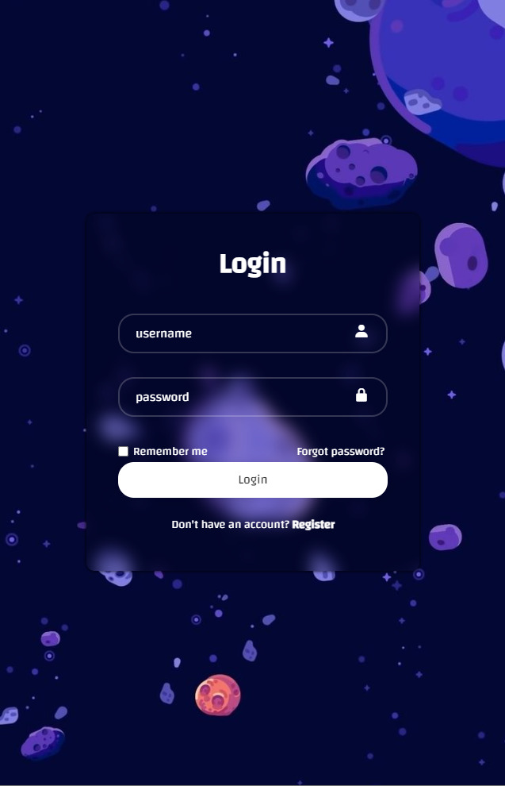

# Login-Form

Este é um formulário de login simples e responsivo feito com HTML e CSS,   
Desenvolvido para apresentar meus conceitos de Programação.

## Resultado Final

  
# 🚀 Decolando!

Para iniciar o projeto, basta abrir o arquivo   `index.html` em seu navegador

---
##### Codificado por Isaac Gregorio 👨‍💻
